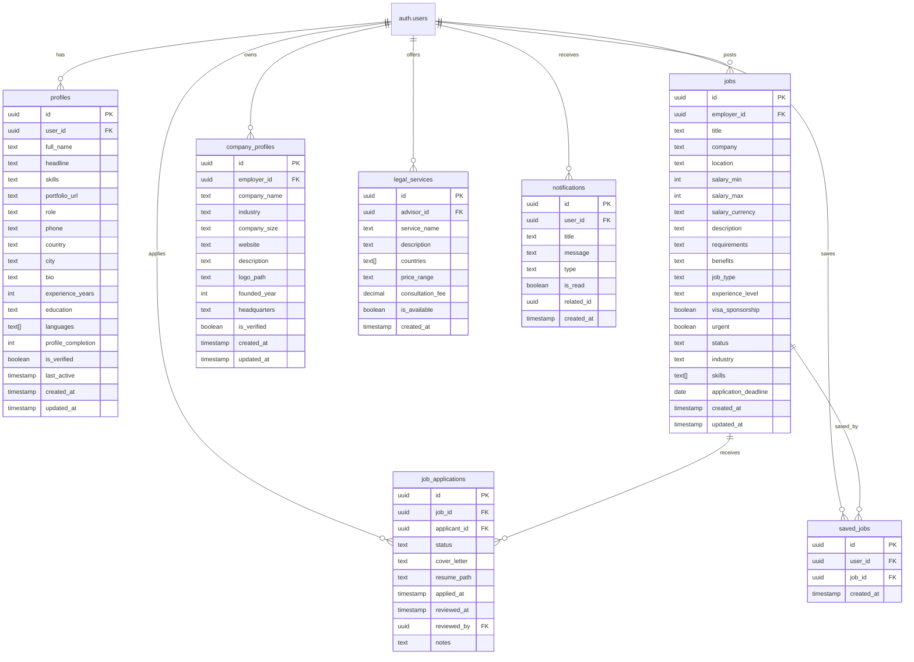

# 🚀 Altroway - European Job Migration Platform

A comprehensive platform helping job seekers migrate to European countries with integrated job search, legal support, and migration guidance.

## 📋 Table of Contents

- [Overview](#overview)
- [System Architecture](#system-architecture)
- [Data Flow & Database Schema](#data-flow--database-schema)
- [User Roles & Permissions](#user-roles--permissions)
- [Complete User Journey](#complete-user-journey)
- [Features by Phase](#features-by-phase)
- [Technical Stack](#technical-stack)
- [Setup Instructions](#setup-instructions)
- [Development Progress](#development-progress)

## 🎯 Overview

Altroway is a comprehensive platform designed to facilitate job migration to European countries. The platform serves three main user types:

- **Job Seekers**: Find jobs, apply, and get migration guidance
- **Employers**: Post jobs, manage applications, and hire international talent
- **Legal Advisors**: Provide legal services for visa and migration support

## 🏗️ System Architecture

```
┌─────────────────┐    ┌─────────────────┐    ┌─────────────────┐
│   Frontend      │    │   Backend       │    │   Database      │
│   (Next.js)     │◄──►│   (Supabase)    │◄──►│   (PostgreSQL)  │
│                 │    │                 │    │                 │
│ • React 19      │    │ • Auth          │    │ • Profiles      │
│ • TypeScript    │    │ • Storage       │    │ • Jobs          │
│ • Tailwind CSS  │    │ • Real-time     │    │ • Applications  │
│ • Radix UI      │    │ • Edge Functions│    │ • Documents     │
└─────────────────┘    └─────────────────┘    └─────────────────┘
```

## 📊 Data Flow & Database Schema

### Core Tables & Relationships



### Data Flow Examples

#### 1. Job Posting Flow
```
Employer → Create Job → jobs table → RLS Policy → Visible to Job Seekers
```

#### 2. Job Application Flow
```
Job Seeker → Apply to Job → job_applications table → Notification to Employer
```

#### 3. Profile Update Flow
```
User → Update Profile → profiles table → Dashboard Updates → Role-based Access
```

## 👥 User Roles & Permissions

### 1. Job Seeker (`job_seeker`)
**Capabilities:**
- ✅ Browse and search jobs
- ✅ Apply to jobs with cover letter and resume
- ✅ Save jobs for later
- ✅ Manage personal profile
- ✅ Upload and manage documents
- ✅ Track application status
- ✅ Receive notifications

**Data Access:**
- View active jobs (all employers)
- Manage own applications
- Manage own saved jobs
- Manage own profile
- View own notifications

### 2. Employer (`employer`)
**Capabilities:**
- ✅ Create and manage job postings
- ✅ View applications for their jobs
- ✅ Review and update application status
- ✅ Manage company profile
- ✅ Access employer dashboard
- ✅ Receive application notifications

**Data Access:**
- Manage own job postings
- View applications for own jobs
- Manage own company profile
- View own notifications

### 3. Legal Advisor (`legal_advisor`)
**Capabilities:**
- ✅ Offer legal services
- ✅ Manage consultation bookings
- ✅ Provide visa support
- ✅ Set service availability
- ✅ Manage service pricing

**Data Access:**
- Manage own legal services
- View service inquiries
- Manage own profile

## 🔄 Complete User Journey

### Job Seeker Journey
```
1. Registration → Choose "Job Seeker" role
2. Profile Setup → Complete profile with skills, experience
3. Job Discovery → Browse jobs, use filters, save interesting ones
4. Application → Apply with cover letter and resume upload
5. Tracking → Monitor application status, receive updates
6. Success → Get hired, receive migration guidance
```

### Employer Journey
```
1. Registration → Choose "Employer" role
2. Company Setup → Create company profile
3. Job Posting → Create detailed job listings
4. Application Review → Review incoming applications
5. Candidate Selection → Shortlist and interview candidates
6. Hiring → Make offers, assist with visa process
```

### Legal Advisor Journey
```
1. Registration → Choose "Legal Advisor" role
2. Service Setup → Define legal services and pricing
3. Client Management → Handle consultation requests
4. Document Support → Assist with visa applications
5. Ongoing Support → Provide migration guidance
```

## 🚀 Features by Phase

### Phase 1: Core Enhancement (1-2 months) ✅
- [x] Complete authentication system
- [x] User profile management
- [x] Role-based access control
- [x] Personalized dashboards
- [x] Document management system
- [x] Job posting and application system

### Phase 2: Service Implementation (2-3 months)
- [ ] Interactive migration guides
- [ ] Country-specific documentation
- [ ] Multi-language support
- [ ] Advanced job search and filtering
- [ ] Interview scheduling system

### Phase 3: Legal Support Integration (2-3 months)
- [ ] Document verification system
- [ ] Legal consultation booking
- [ ] Visa application tracking
- [ ] Integration with legal partners

### Phase 4: Community & Growth (2-3 months)
- [ ] User forums and discussion boards
- [ ] Success stories platform
- [ ] Networking events calendar
- [ ] Analytics dashboard

### Phase 5: Scale & Optimize (Ongoing)
- [ ] Performance optimization
- [ ] Mobile app development
- [ ] API development
- [ ] Multi-currency support

## 🛠️ Technical Stack

### Frontend
- **Framework**: Next.js 15 with App Router
- **Language**: TypeScript
- **Styling**: Tailwind CSS + Radix UI
- **State Management**: React Server Components + Server Actions
- **Authentication**: Supabase Auth

### Backend
- **Database**: PostgreSQL (Supabase)
- **API**: Supabase REST API + Edge Functions
- **Storage**: Supabase Storage
- **Real-time**: Supabase Realtime
- **Security**: Row Level Security (RLS)

### Development Tools
- **Package Manager**: npm/pnpm
- **Linting**: ESLint
- **Formatting**: Prettier
- **Type Checking**: TypeScript
- **Version Control**: Git

## 🚀 Setup Instructions

### Prerequisites
- Node.js 18+ 
- npm or pnpm
- Supabase account

### 1. Clone and Install
```bash
git clone <repository-url>
cd Altroway
npm install
```

### 2. Environment Setup
Create `.env.local` file:
```env
NEXT_PUBLIC_SUPABASE_URL=your_supabase_url
NEXT_PUBLIC_SUPABASE_ANON_KEY=your_supabase_anon_key
SUPABASE_SERVICE_ROLE_KEY=your_service_role_key
NEXT_PUBLIC_SITE_URL=http://localhost:3000
```

### 3. Database Setup
1. Go to Supabase Dashboard
2. Navigate to SQL Editor
3. Run the migration from `supabase/migrations/05_complete_schema.sql`

### 4. Start Development
```bash
npm run dev
```

### 5. Test the System
1. **Create Test Accounts:**
   - Job Seeker: Register with role "job_seeker"
   - Employer: Register with role "employer"
   - Legal Advisor: Register with role "legal_advisor"

2. **Test Job Posting Flow:**
   - Login as employer
   - Create a job posting
   - Login as job seeker
   - Apply to the job
   - Check application in employer dashboard

3. **Test Profile Management:**
   - Update profile information
   - Verify role-based access

## 📈 Development Progress

### ✅ Completed Features
- [x] Authentication system with role-based access
- [x] User profile management with CRUD operations
- [x] Job posting system for employers
- [x] Job application system for job seekers
- [x] Role-based dashboards
- [x] Database schema with RLS policies
- [x] File upload system
- [x] Notification system structure
- [x] Responsive UI with modern design

### 🔄 In Progress
- [ ] Advanced job search and filtering
- [ ] Document verification system
- [ ] Legal services integration
- [ ] Migration guides implementation

### 📋 Next Steps
1. **Apply Database Migration**: Run the complete schema migration
2. **Test CRUD Operations**: Verify all create, read, update, delete operations
3. **Role Testing**: Test each user role's capabilities
4. **Integration Testing**: Test complete user journeys
5. **Performance Optimization**: Optimize queries and UI performance

## 🔍 Testing Checklist

### Database Operations
- [ ] Profile creation and updates
- [ ] Job posting and management
- [ ] Job applications and tracking
- [ ] File uploads and storage
- [ ] Role-based access control

### User Flows
- [ ] Job seeker registration and job application
- [ ] Employer registration and job posting
- [ ] Legal advisor service management
- [ ] Cross-role interactions

### Security
- [ ] Row Level Security policies
- [ ] Authentication and authorization
- [ ] Data validation and sanitization
- [ ] File upload security

## 🤝 Contributing

1. Fork the repository
2. Create a feature branch
3. Make your changes
4. Test thoroughly
5. Submit a pull request

## 📄 License

This project is licensed under the MIT License.

---

**Altroway** - Making European job migration seamless and accessible for everyone! 🌍✨
